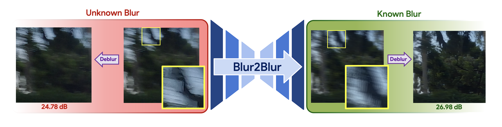

# Official Pytorch Implementation of "Blur2Blur: Blur Conversion for Unsupervised Image Deblurring on Unknown Domains" [(CVPR'24)](https://cvpr.thecvf.com/)

[](https://arxiv.org/abs/2403.16205)
[](https://zero1778.github.io/blur2blur/)
[](https://www.youtube.com/watch?v=CMjxtElp9g4)


<div align="center">
  <a href="https://zero1778.github.io" target="_blank">Bang-Dang&nbsp;Pham</a> &emsp; <b>&middot;</b> &emsp;
  <a href="https://scholar.google.com/citations?hl=en&authuser=1&user=-BPaFHcAAAAJ" target="_blank">Phong&nbsp;Tran</a> &emsp; 
  <b>&middot;</b> &emsp;
  <a href="https://sites.google.com/site/anhttranusc/" target="_blank">Anh&nbsp;Tran</a> &emsp; 
  <b>&middot;</b> &emsp;
  <a href="https://sites.google.com/view/cuongpham/home" target="_blank">Cuong&nbsp;Pham</a> &emsp; 
  <b>&middot;</b> &emsp;
  <a href="https://rangnguyen.github.io/" target="_blank">Rang&nbsp;Nguyen</a> &emsp; 
  <b>&middot;</b> &emsp;
  <a href="https://gshoai.github.io" target="_blank">Minh&nbsp;Hoai</a> &emsp; 
  <br> <br>
  <a href="https://www.vinai.io/">VinAI Research, Vietnam</a>
</div>
<br>
<div align="center">
    
</div>

> **Abstract**: This paper presents an innovative framework designed to train an image deblurring algorithm tailored to a specific camera device. This algorithm works by transforming a blurry input image, which is challenging to deblur, into another blurry image that is more amenable to deblurring. The transformation process, from one blurry state to another, leverages unpaired data consisting of sharp and blurry images captured by the target camera device. Learning this blur-to-blur transformation is inherently simpler than direct blur-to-sharp conversion, as it primarily involves modifying blur patterns rather than the intricate task of reconstructing fine image details. The efficacy of the proposed approach has been demonstrated through comprehensive experiments on various benchmarks, where it significantly outperforms state-of-the-art methods both quantitatively and qualitatively.

Details of the model architecture and experimental results can be found in [our paper](https://arxiv.org/abs/2403.16205):

```bibtext
@inproceedings{pham2024blur2blur,
 author={Pham, Bang-Dang and Tran, Phong and Tran, Anh and Pham, Cuong and Nguyen, Rang and Hoai, Minh},
 booktitle={Proceedings of the IEEE/CVF Conference on Computer Vision and Pattern Recognition (CVPR)},
 title={Blur2Blur: Blur Conversion for Unsupervised Image Deblurring on Unknown Domains},
 year={2024}
}
```
**Please CITE** our paper whenever this repository is used to help produce published results or incorporated into other software.


## Table of contents
1. [Getting Started](#getting-started)
2. [Datasets](#datasets-floppy_disk)
3. [Blur2Blur](#blur2blur-rocket)
4. [Results](#results-trophy)
5. [Acknowledgments](#acknowledgments)
6. [Contacts](#contacts-mailbox_with_mail)

## Getting Started :sparkles:

### Prerequisites
- Python >= 3.7
- Pytorch >= 1.9.0
- CUDA >= 10.0


### Installation
Install dependencies:
```shell
git clone https://github.com/VinAIResearch/Blur2Blur
cd Blur2Blur

conda create -n blur2blur python=3.9  
conda activate blur2blur  
pip install -r requirements.txt  
```

## Datasets :floppy_disk:

### Data Preperation
You can download our proposed RB2V dataset by following this script:
```
chmod +x ./dataset/download_RB2V.sh
bash ./dataset/download_RB2V.sh
``` 
Download datasets [REDS](https://seungjunnah.github.io/Datasets/reds.html), [GoPro](https://seungjunnah.github.io/Datasets/gopro.html) and [RSBlur](https://cg.postech.ac.kr/research/rsblur/) then unzip to folder `./dataset` and organize following this format:
<pre>
dataset
├── Name of Unknown-Known dataset e.g. RB2V-GoPro
    ├── trainA
    ├──── <i>(Train) Blurry set of Unknown Blur</i>
    ├──── ...
    ├── trainB
    ├──── <i>(Train) Sharp set of Unknown Blur</i>
    ├──── ...
    ├── trainC
    ├──── <i>(Train) Blurry set of Known Blur</i>
    ├──── ...
    ├── trainD
    ├──── <i>(Train) Sharp set of Known Blur</i>
    ├──── ...
    ├── testA
    ├──── <i>(Test) Blurry set of Unknown Blur</i>
    ├──── ...

</pre>
where:
* <b>trainA, trainB</b>: Blur/Sharp images from the Unknown Blur dataset for blur kernel conversion.
* <b>trainC, trainD</b>: Blur/Sharp images from the Known Blur dataset for the target blur domain.
* <b>testA</b>: Blurry images from the `test-set` of the Unknown Blur dataset.

## Blur2Blur :rocket:

### Training
To train the model:
```.bash
python train.py --dataset_name dataname --metadata_root path/to/metadata.json
```
or 
```.bash
bash ./scripts/train.sh
```

### Evaluation
To evaluate the model:
```.bash
python test.py --dataset_name dataname --metadata_root path/to/metadata.json
```
or 
```.bash
bash ./scripts/test.sh
```

### Using Blur2Blur
After training Blur2Blur, you can use our pretrained model to generate a converted image for each sample using this script:
```.bash
python demo.py --pretrained_path path/to/pretrained_Blur2Blur.pth \
    			--save_path path/to/generated_metadata.json \
    			
```


## Results :trophy:
For more interactive results, you can take a look at my project page: https://zero1778.github.io/blur2blur/

## Acknowledgments
We would like to extend our gratitude to the following implementations for their contributions to the development of Blur2Blur:

- [pix2pix](https://github.com/junyanz/pytorch-CycleGAN-and-pix2pix) for providing the foundational code model.
- [uvcgan2](https://github.com/junyanz/pytorch-CycleGAN-and-pix2pix) for helping to enhance the baseline code.
- [MIMO-UNet](https://github.com/junyanz/pytorch-CycleGAN-and-pix2pix) and [Blur Kernel Extractor](https://github.com/junyanz/pytorch-CycleGAN-and-pix2pix) for creating the backbone and submodules integral to our project.

## Contacts :mailbox_with_mail:
If you have any questions or suggestions about this repo, please feel free to contact me (bangdang2000@gmail.com).